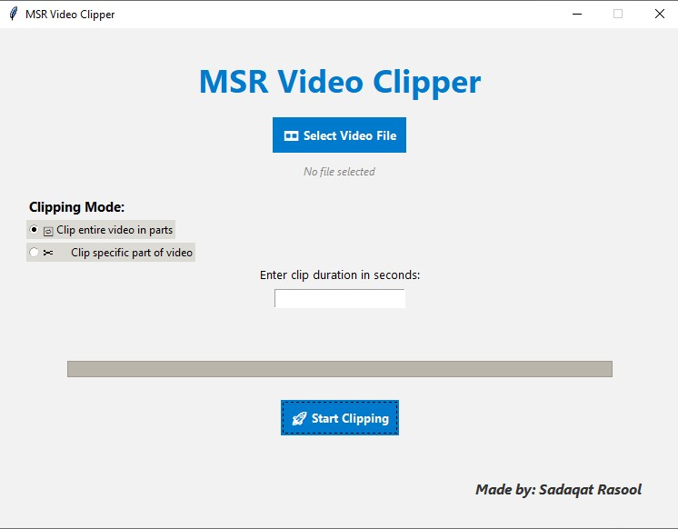
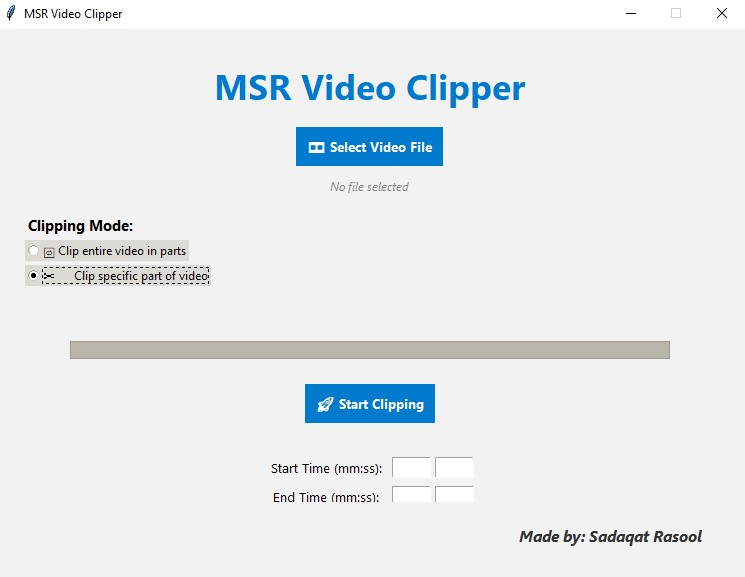
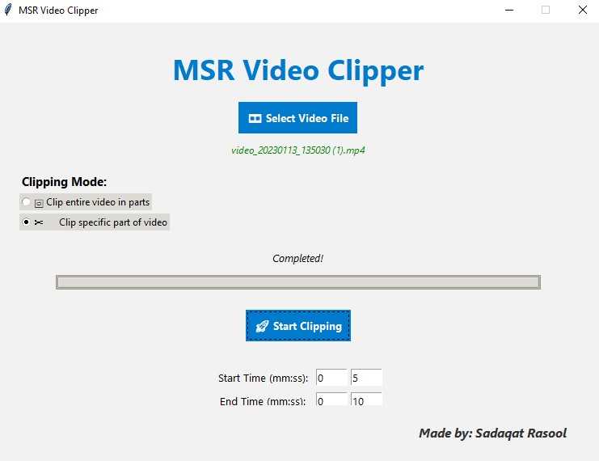

# 🎬 MSR Video Clipper

**MSR Video Clipper** is a lightweight yet powerful desktop tool that helps you split large video files into smaller clips with ease. Whether you want to break a movie into parts or extract a specific segment, this tool gets it done in seconds — all offline, with a clean and intuitive UI.

---

## ✨ Key Features

- 🎞️ **Select any video file** from your PC (.mp4, .avi, .mov, .mkv supported)
- ✂️ **Two Clipping Modes**:
  - **Full Video Split**: Breaks the entire video into multiple equal-duration clips.
  - **Specific Part Clip**: Lets you define exact start and end time to extract a segment.
- ⏱️ Enter duration (in seconds) or precise times (mm:ss)
- 🧠 **Smart error handling** for wrong input, missing file, or invalid time values
- 📂 Output clips saved in the **same folder** as the original file
- 🔥 Ultra-fast, lossless cutting using **FFmpeg**
- 📦 Runs as a **single portable .exe** — no installation or dependencies required

---

## 📸 Screenshots


### 🖼️ 1. Entire Video Mode

  
_UI for entering the clip duration to split the entire video into equal-length parts._

---

### 🖼️ 2. Specific Segment Clip Option

  
_UI for setting start and end times (mm:ss) to extract a specific portion of the video._

---

### 🖼️ 3. Clipping Completed

  
_Final screen showing the successful completion of the clipping process._

---

## 🔗 Download MSR Video Clipper

⚠️ This software is private and access is **request-based**. Request permission below:

- 🔽 [Download Executable (.exe)](https://drive.google.com/file/d/1cbOzWNSByMCI1Gop8BZ347ZXkl1jtdgf/view?usp=drive_link)
- 🧠 [Download Python Source Code (.py)](https://drive.google.com/file/d/11aDFpfMmCCTUK7xqyTbNYyYL8_HwEMjc/view)

---

## 💻 Developer Guide (Run from Source)

If you want to run the Python version:

### ✅ Requirements

- Python 3.10+
- moviepy
- FFmpeg

### 📦 Setup

1. Clone or download the repo  
2. Install required library:
   ```bash
   pip install moviepy
   ```

3. Download ffmpeg.exe and place it like this:

```
your_project/
├── code.py
└── ffmpeg/
    └── ffmpeg.exe
```

4. Run the app:

```bash
python code.py
```

✅ The .exe version already bundles ffmpeg, so you don’t need to worry about this!

---

## 🧠 How It Works

### 🟢 Full Video Clipping

- Enter how many seconds long each clip should be  
- App calculates number of clips & slices video using FFmpeg  
- Each part is saved as: `filename_part1.mp4`, `filename_part2.mp4`, etc.

### 🟣 Specific Segment Clipping

- Choose exact start and end time (mm:ss format)  
- The app clips only that portion — great for extracting highlights or reels

---

## ⚠️ Error Handling Built-In

- ❌ No video selected? You’ll be prompted!
- ❌ Invalid file type? Only video formats allowed.
- ❌ Invalid clip duration? You'll get an error if it’s too short or longer than the video.
- ❌ Start time > End time? Nope, app stops you from slicing backwards.
- 💬 Friendly alerts via message boxes guide the user at every step.

---

## 🛠 Tech Stack

- **Python 🐍** — core logic and UI  
- **Tkinter 🪟** — native desktop interface  
- **MoviePy 🎞** — used for validation and basic video parsing  
- **FFmpeg 🚀** — ultra-fast, lossless clipping  
- **PyInstaller 📦** — compiles everything into a clean .exe

---

## 🔐 License

This tool is for educational purposes and private use only. To request permission to use or distribute, open an issue or request via the download link.

---

## 🧑‍💻 Author

Developed by Sadaqat Rasool

- 🔗 [Github Profile](https://github.com/sadaqat120) 
- 📧 [Email](mailto:sadaqatrasoolmsr@gmail.com) 
- 💬 Collaboration & support welcome!
